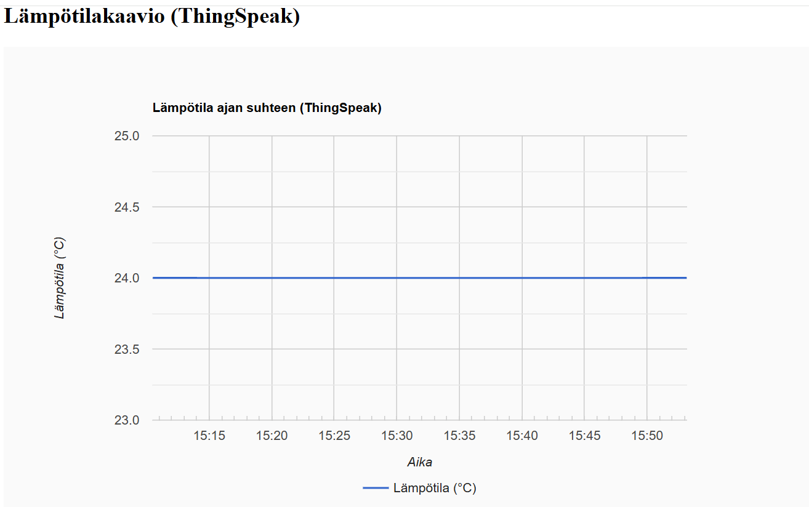
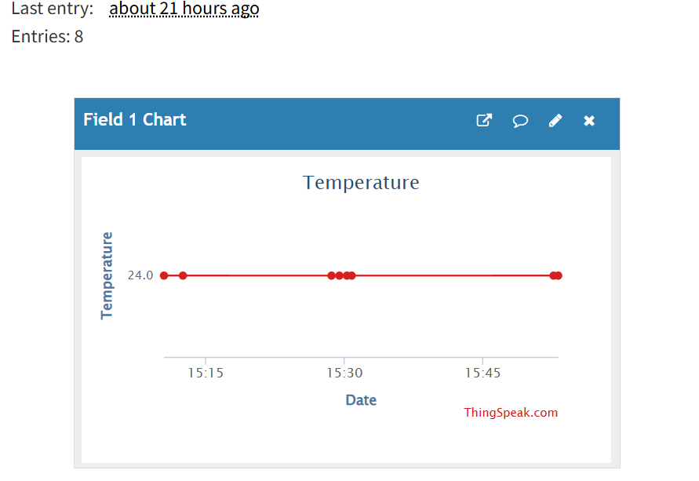

# 📘 IOT-perusteet

# Week 1 – MicroPython Exercises with Raspberry Pi Pico
## 🧠 Overview
During Week 1, I completed several MicroPython tasks using the Raspberry Pi Pico. 
## ✅ Tasks Summary
### 1. Name Recognition
A simple script that asks for the user's name and checks if it's "Clark Kent". If so, it prints a special message.
### 2. Reaction Timer
Measures how fast the user reacts after an LED turns off. Uses a button, random delay, and interrupt handling.
### 3. Button-Controlled LED
Turns an LED on when a button is pressed and off when released. Demonstrates basic GPIO input/output.
### 4. Traffic Light with Buzzer
Simulates a traffic light sequence using red, yellow, and green LEDs. Includes a buzzer alert when a button is pressed.

# Week 2 – MicroPython Projects with Raspberry Pi Pico

## 🧠 Overview

During Week 2 tasks focused on using external components like LCD displays and sensors, and sending data to the cloud.
---

## ✅ Task 1: I2C LCD Display

### Description
Displayed a message on a 20x4 I2C LCD screen using MicroPython.

### Highlights
- I2C communication via GPIO 0 (SDA) and GPIO 1 (SCL)
- External libraries used: `pico_i2c_lcd.py` and `lcd_api.py`
- Message displayed: `"Hello student"`
---
## ✅ Task 2: DHT22 Sensor + ThingSpeak Integration

### Description
Read temperature data from a DHT22 sensor and sent it to ThingSpeak over Wi-Fi.
---

## ✅ Task 3: Local Temperature & Humidity Display

### Description
Read and printed temperature and humidity values from a DHT22 sensor locally via serial output.

### Highlights
- Sensor readings every 2 seconds
- Printed formatted output: `Temperature: XX.X°C, Humidity: XX.X%`
- Error handling for sensor read failures

---
# Week 3 – Node.js REST API with SQLite

## 🧠 Overview

In Week 3, I created a simple REST API using **Node.js** and **SQLite**. The project includes endpoints for handling user data and simulating sensor readings.
---

## ✅ Features

### 📦 Database
- SQLite database: `Mirandatabase.db`
- Table: `users` with fields `id`, `name`, and `email`
- Table is created automatically if it doesn't exist

### 🌐 API Endpoints

#### `GET /api/sensor`
Returns mock sensor data:

{
  "temperature": 22.5,
  "humidity": 55,
  "status": "OK"
}
# Week 4
## 🔧 Technologies Used

- **JavaScript (Frontend)**: Fetches and visualizes temperature data from ThingSpeak.
- **Node.js (Backend)**: Implements a WebSocket server for real-time communication.
- **ThingSpeak**: Cloud platform used to store and retrieve sensor data.
- **Google Charts**: Used to render a line chart of temperature over time.
- **HTML/CSS**: Basic structure and styling of the web interface.
---
## 🔄 Pipeline Overview

The project follows a basic IoT data pipeline:

1. **Sensor Measurement**: A temperature sensor sends readings to a ThingSpeak channel.
2. **Data Storage**: ThingSpeak stores the data and provides a public API for access.
3. **Backend Communication**: A Node.js WebSocket server enables real-time messaging between client and server.
4. **Frontend Visualization**:
   - JavaScript fetches temperature data from ThingSpeak.
   - Google Charts renders a line chart showing temperature trends over time.
---
# Temperature Charts
This project visualizes temperature data from ThingSpeak using Google Charts.  
Below you can see two different chart images side by side: one from the browser and one directly from ThingSpeak.

  
  

This pipeline demonstrates how sensor data can be collected, transmitted, and visualized in a web application.
---
## 📁 Files Included

- `server.js`: Node.js WebSocket server implementation.
- `index.html`: Frontend interface with input field, WebSocket client, and chart container.
- `chart.js`: JavaScript logic for fetching ThingSpeak data and rendering the chart.
- `README.md`: Documentation of the project.

